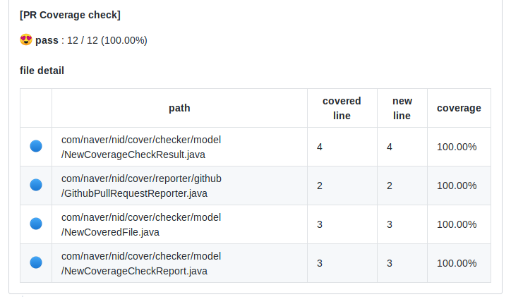

# CoverChecker

이 스크립트는 신규 코드에 대한 코드 커버리지를 측정하여 프로젝트 기준에 충족하는지를 판별하고  
해당 pr에서 변경된 소스코드의 코드 커버리지가 어떻게 되는지 풀 리퀘스트에 피드백을 해줍니다.

**코드 커버리지**는 작성한 코드에 대해 얼마나 테스트코드를 통해 검증되었는지 확인하는 지표입니다.
제대로 작성된 테스트코드는 릴리즈 이전 소스코드의 버그를 미리 탐지하고 
그로 인해 발생할 수 있는 장애를 미연에 방지할 수 있습니다.

> 최근 스프링의 컴포넌트 중 하나인 [Spring REST doc](https://spring.io/projects/spring-restdocs)의 경우 작성한 
테스트 코드를 참고하여 자동으로 api 문서를 만들어주기도 합니다.

이런 이유로 많은 팀에서 테스트 코드를 적용하기 위해 노력하고 있지만 
몇 천 줄은 가뿐히 넘는 기존 코드상에 테스트 코드를 전부 적용하기란 쉽지 않습니다.
이 스크립트를 통해 새로 작성 / 수정하는 코드들에 조금씩 커버리지를 늘려 
프로젝트의 전반적인 커버리지도 올리고 각 팀원의 프로그래밍 습관도 개선 해보세요.

## 기능

- github에서 pr 정보를 불러와 변경된 코드를 찾습니다.
- 커버리지 측정 레포트를 읽어 테스트코드가 어떤 부분을 테스트하고 있는지 확인 합니다.
- 두 정보를 조합해 변경된 코드에 테스트 코드가 테스트를 하고 있는지 확인합니다.
- 확인한 결과를 comment와 commit status로 남겨 코드리뷰 시 리뷰어가 확인할 수 있게 합니다.
- 커버리지 threshold는 전체 코드 라인, 각 파일 별로 지정할 수 있습니다.

## 적용 방법 (jenkins)

- 사용하시는 ci 혹은 빌드 서버에 `1.8 버전 이상의 jdk`를 설치합니다.
- CoverChecker를 클론한 후 빌드합니다.
- 생성된 jar 파일을 원하는 위치에 둡니다.
- jenkins 잡에서 coverage report를 생성하도록 빌드 설정을 변경합니다. 현재 지원하는 레포트는 `jacoco html`, `jacoco xml`, `cobertura xml` 입니다.
- post build 설정으로 스크립트가 실행되게 합니다. 실행 방법은 아래를 참고합니다.
- 정상적으로 실행되면 풀 리퀘스트에 다음과 같이 나타납니다.




## 빌드

```sh
$ ./mvnw clean compile package
```

실제 사용할 파일은 `cover-checker-console/target/coverchecker-${version}-jar-with-dependencies.jar` 입니다.

## 실행

```sh
java -jar cover-checker-console/target/cover-checker-console-${version}-jar-with-dependencies.jar \
    --cover ${coverageReportPath} \
    [--cover ${otherCoverageReportPath}] \
    --github-token ${githubAccessToken} \
    --repo ${githubRepositoryPath} \
    --threshold ${coverageThreshold} \
    --github-url ${githubHost} \
    --pr ${pullrequestNo} \
    -type (jacoco | cobertura)
```

### 파라메터 설명
```sh
usage: coverchecker.jar -c <arg> [-d <arg>] [-dt <arg>] [-ft <arg>] [-g <arg>]
       [-p <arg>] [-r <arg>] -t <arg> [-type <arg>] [-u <arg>]
-c,--cover <arg>          coverage report paths(absolute recommend), coverage
                          report path can take multiple paths for multi-module
                          project
-d,--diff <arg>           diff file path(absolute recommend)
-dt,--diff-type <arg>     diff type (github | file)
-ft,--file-threshold <arg>coverage report type (jacoco | cobertura) default is
                          jacoco
-g,--github-token <arg>   github oauth token
-p,--pr <arg>             github pr number
-r,--repo <arg>           github repo
-t,--threshold <arg>      coverage pass threshold
-type <arg>               coverage report type (jacoco | cobertura) default is
                          jacoco
-u,--github-url <arg>     The url when you working on github enterprise url.
                          default is api.github.com
```
